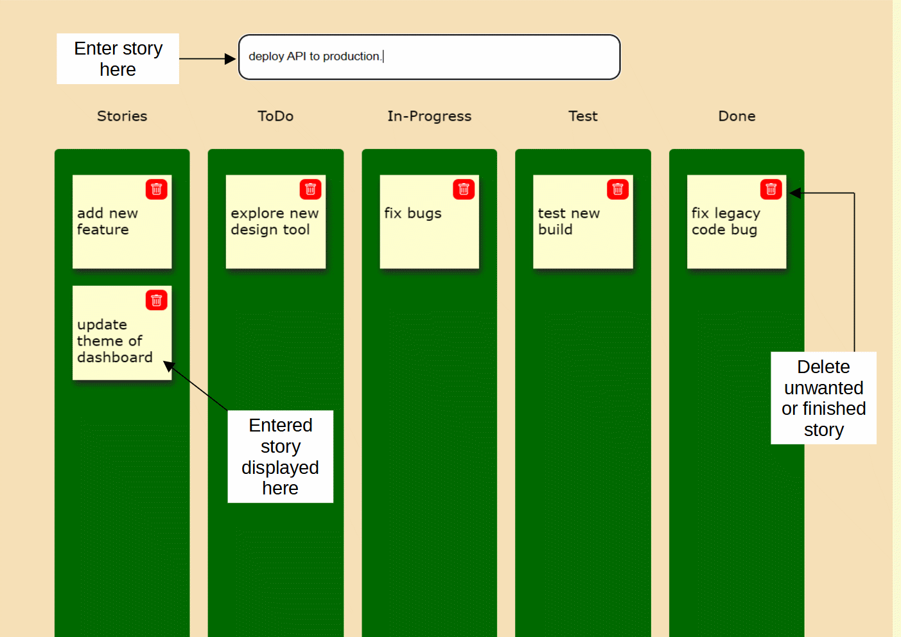

# Kanban Board
A kanban board is one of the tools that can be used to implement kanban to manage work at a personal or organizational level. 
Kanban boards visually depict work at various stages of a process using cards to represent work items and columns to represent each stage of the process.

## About Project
- Kanban board is made using plain HTML,CSS and Vanilla Javascript, as it is a static site with one page.
- Using drag & drop to move & place cards accross board by utilising Drag & Drop event listener on the cards and board.

## Contribution
Project is easy to understand, so devs new to open source can contribute to this project by finding bugs, suggesting new features etc.
Will be happy to merge good pull requests.

## Working
Below image shows working of project.

